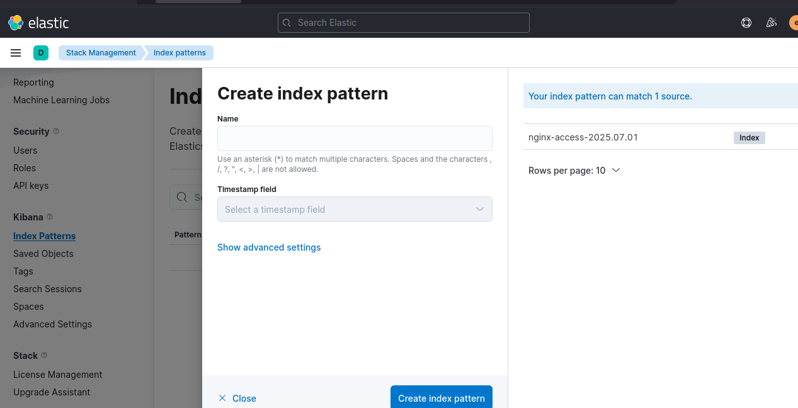
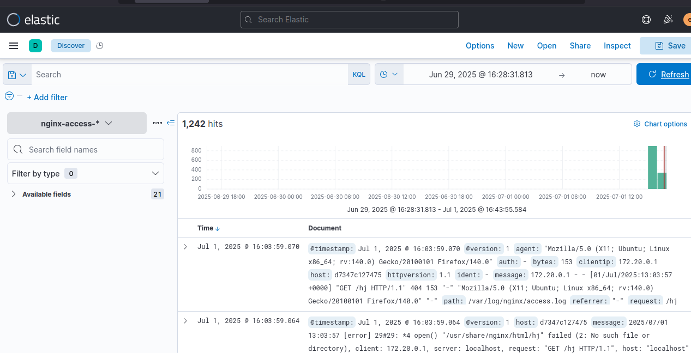

# Домашнее задание к занятию «ELK» Шелухин Юрий

## Дополнительные ресурсы

При выполнении задания используйте дополнительные ресурсы:
- [docker-compose elasticsearch + kibana](11-03/docker-compose.yaml);
- [поднимаем elk в docker](https://www.elastic.co/guide/en/elasticsearch/reference/7.17/docker.html);
- [поднимаем elk в docker с filebeat и docker-логами](https://www.sarulabs.com/post/5/2019-08-12/sending-docker-logs-to-elasticsearch-and-kibana-with-filebeat.html);
- [конфигурируем logstash](https://www.elastic.co/guide/en/logstash/7.17/configuration.html);
- [плагины filter для logstash](https://www.elastic.co/guide/en/logstash/current/filter-plugins.html);
- [конфигурируем filebeat](https://www.elastic.co/guide/en/beats/libbeat/5.3/config-file-format.html);
- [привязываем индексы из elastic в kibana](https://www.elastic.co/guide/en/kibana/7.17/index-patterns.html);
- [как просматривать логи в kibana](https://www.elastic.co/guide/en/kibana/current/discover.html);
- [решение ошибки increase vm.max_map_count elasticsearch](https://stackoverflow.com/questions/42889241/how-to-increase-vm-max-map-count).

**Примечание**: если у вас недоступны официальные образы, можете найти альтернативные варианты в DockerHub, например, [такой](https://hub.docker.com/layers/bitnami/elasticsearch/7.17.13/images/sha256-8084adf6fa1cf24368337d7f62292081db721f4f05dcb01561a7c7e66806cc41?context=explore).

## Задание 1. Elasticsearch 
Установите и запустите Elasticsearch, после чего поменяйте параметр cluster_name на случайный. 

*Приведите скриншот команды 'curl -X GET 'localhost:9200/_cluster/health?pretty', сделанной на сервере с установленным Elasticsearch. Где будет виден нестандартный cluster_name*.

---

### Решение 1.
1. Установим Docker    
`sudo apt  install docker-compose`
Установим стек ELK.  
`sudo docker-compose up`  
Через команду `docker ps -a` посмотрим список работающих контенейнеров, определим id elastic.  
   

2. Зайдем внутрь контейнера через команду `sudo docker exec -it 01834b15e04d bash` и командой `curl -u elastic:test -X GET 'localhost:9200/_cluster/health?pretty'` проверим конфигурацию (с указанием имени и пароля).  
    

Теперь поменяем имя кластера в конфигурационном файле, который прокидывается внутрь контейнера.  
    
    

4. Перезапустим один контейнер командой `sudo docker-compose restart elasticsearch` и вновь зайдем в него для проверки конфигурации.    

---

#### Задание 2. Kibana
Установите и запустите Kibana.

*Приведите скриншот интерфейса Kibana на странице http://<ip вашего сервера>:5601/app/dev_tools#/console, где будет выполнен запрос GET /_cluster/health?pretty*.

---

### Решение 2.
1. Установим стек ELK.  
`sudo docker-compose up`  
Через команду `docker ps -a` посмотрим список работающих контейнейнеров, в том числе Kibana.  
  

2.   Обратимся к браузеру по адресу: http://192.168.65.135:5601/app/dev_tools#/console (или localhost вместо ip).    
         

Выполним запрос GET.   
  

#### Конфигурационный файл.  
[конфигурация Kibana](configs/kibana/config.yml)

---

### Задание 3. Logstash

Установите и запустите Logstash и Nginx. С помощью Logstash отправьте access-лог Nginx в Elasticsearch. 

*Приведите скриншот интерфейса Kibana, на котором видны логи Nginx.*

---

### Решение 3
1. Добавим в Docker-compose.yml конфигурацию Nginx:
   
Nginx:
    image: nginx:latest
    ports:
      - "80:80"
    volumes:
      - ./nginx_logs:/var/log/nginx
    networks:
      - elk    
    environment:
      - NGINX_USER=root
      - NGINX_ERROR_LOG_FILE=/var/log/nginx/error.log
      - NGINX_ACCESS_LOG_FILE=/var/log/nginx/access.log 
    restart: always`

    и добавим volume в Logstash:

`logstash:
    image: logstash:7.16.2
    volumes:
      - ./configs/logstash/config.yml:/usr/share/logstash/config/logstash.yml
      - ./configs/logstash/pipelines.yml:/usr/share/logstash/config/pipelines.yml
      - ./configs/logstash/pipelines:/usr/share/logstash/config/pipelines
##### - ./nginx_logs:/var/log/nginx`

Проверим, много раз исправим ошибки,в т.ч.:  
    - версия должна быть одинаковой у всех сервисов;  
    - настроимразные разрешения у конфиг файлов (777, 640);  
    - 7-ую версию проще настроить чем 8-ую;  
    - ищем логи `docker-compose exec logstash tail -n 5 /var/log/nginx/access.log` и т.д.;  
    - для теста фильтр лучше брать попроще;  
    - nginx на хосте занимает тот-же порт 80 что и в контенере (systemctl stop...),  
 при запуске получим:  
   
 

---

### Задание 4. Filebeat. 

Установите и запустите Filebeat. Переключите поставку логов Nginx с Logstash на Filebeat. 

*Приведите скриншот интерфейса Kibana, на котором видны логи Nginx, которые были отправлены через Filebeat.*

## Дополнительные задания (со звёздочкой*)
Эти задания дополнительные, то есть не обязательные к выполнению, и никак не повлияют на получение вами зачёта по этому домашнему заданию. Вы можете их выполнить, если хотите глубже шире разобраться в материале.

### Задание 5*. Доставка данных 

Настройте поставку лога в Elasticsearch через Logstash и Filebeat любого другого сервиса , но не Nginx. 
Для этого лог должен писаться на файловую систему, Logstash должен корректно его распарсить и разложить на поля. 

*Приведите скриншот интерфейса Kibana, на котором будет виден этот лог и напишите лог какого приложения отправляется.*

#### Конфигурационные файлы.  
[конфигурация Docker-compose](docker-compose.yml)  